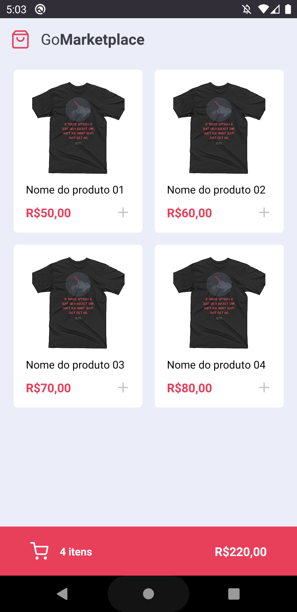
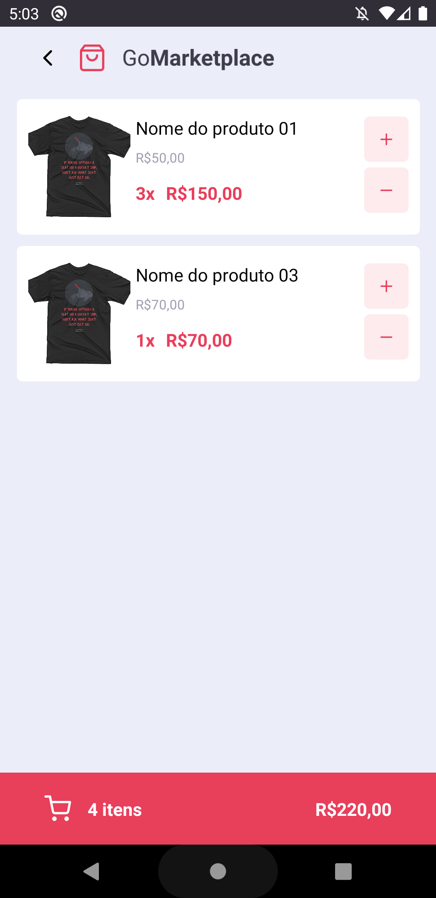

# Go Marketplace

## Sobre o projeto

App desenvolvido utilizando React Native com Typescript. No app é possível adicionar e remover itens ao seu carrinho de compras, tendo o sub-total de cada item calculado e o total geral. Além disso, também é informado a quantidade de cada item e o valor unitário dele.

Os dados do app estão sendo fornecidos utilizando um servidor fake com **json-server**.

## Fotos do App

### Tela Inicial

Na tela inicial é possível visualizar os itens disponíveis a serem adicionados. E também a quantidade de itens já adicionados, como também o preço total.

### Itens adicionados ao carrinho

Navegue para esta tela para visualizar o itens que já foram adicionados ao carrinho. Nela é possível adicionar mais quantidade de itens já selecionados ou remover os já existentes.

## Como rodar os testes

Com a aplicação rodando, utlize o comando `npm run test` para iniciar os testes
